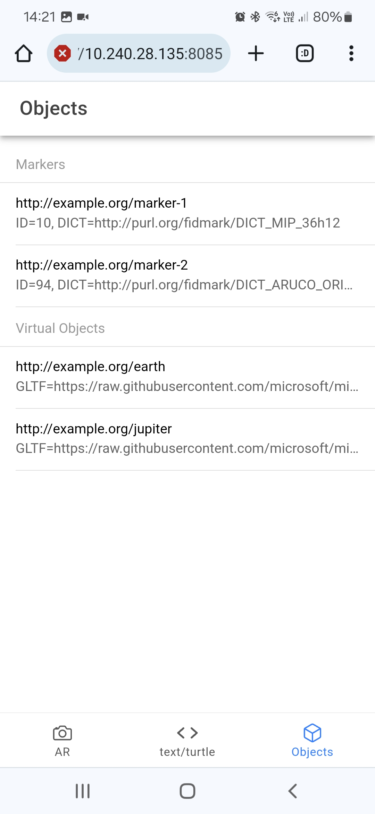

# FidMark: A Fiducial Marker Ontology for Semantically Describing Visual Markers

    

## Documentation

**FidMark Ontology (en)**: [https://fidmark.openhps.org/1.0/en/](https://fidmark.openhps.org/1.0/en/)
**FidMark Demonstrator**: [https://fidmark.openhps.org/application/](https://fidmark.openhps.org/application/)

### Directories and Files
- `/1.0/`: FidMark 1.0 ontology files and allignment(s)
    - `/1.0/dicom/`: FidMark DICOM allignment
- `/website/`: Generated documentation and WIDOCO settings
- `/docs/`: Documentation and images
    - `/docs/images/`: Ontology images
- `/openhps/`: [OpenHPS](https://openhps.org) library for FidMark
- `/examples/`: Ontology examples and demonstrator(s) 
    - `/examples/eswc2024`: AR application from RDF data
    - `/examples/eswc2024_generator`: Generator for test data used for the SPARQL queries
    - `/examples/virtual_objects.ttl`: Generated test data for SPARQL queries
- `/dependencies/`: Dependendency ontology for Protege caching (not important)

### Changelog
*Changelog is not kept before ESWC 2024 conference*

## Methodology
Our design approach for the requirements in our ontology is based on the Linked Open Terms (LOT) methodology. Due to the already existing ontologies for describing fiducial markers in medical sciences, we decided to focus on fiducial markers used within the domain of augmented reality, primarily for position and orientation estimation (commonly defined as a pose). We started by doing an analysis of the different types of markers that exist for different applications within the domain of computer vision. Next, using this set of different markers with their own use-cases for different scenarios and environmental conditions, we have listed a set of use cases, design goals and required data for each type of marker.

Based on the marker analysis and their data, we determined the common attributes and properties of each marker. Two of the main common properties of each marker is the inclusion of an identifier and its ability to be used to determine a pose. Depending on the type of encoding and error correction, these markers use a dictionary that contains a set of possible identifiers that can be encoded within the marker. Image sensors that scan for these markers should know which dictionary is used.

For the terminologies used for these properties we relied on common terms used within academic research as well as standardisation's of fiducials and their intrinsic properties for various domains. We also investigated frameworks and libraries that scan for markers and the variable names that were used for expressing the data.

## Usage and Examples

    
    
    

## License and Contributions
FidMark is licensed under the [CC BY-SA 4.0 license](https://creativecommons.org/licenses/by-sa/4.0/) and maintained by the Web & Information Systems Engineering Lab at the Vrije Universiteit Brussel. Contributions under the CC BY-SA 4.0 license are welcome. Please open an issue or pull request to request features or changes to the ontology, examples or other related resources.
